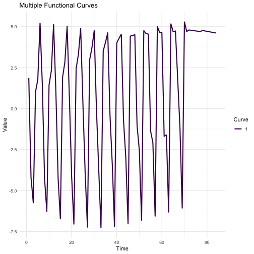
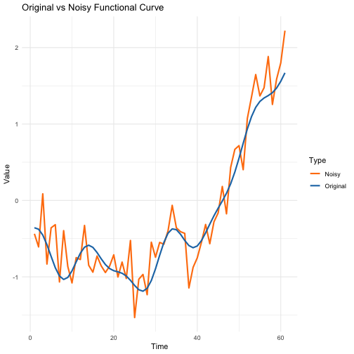

``` r
library(VDPO)
```

The VDPO R package is designed to extend statistical methods for analyzing variable domain functional data. In traditional functional data analysis, observations are usually defined over a common and fixed domain, such as time or spatial coordinates. However, in some applications, the domain over which the data are defined may vary between observations. This type of data is referred to as variable domain functional data.

The methodologies implemented in the VDPO package can be applied to a wide range of fields like:

-   Medical Research and Biostatistics: Analyzing time-dependent physiological measurements or growth trajectories where the observation periods may vary across individuals.
-   Environmental Sciences: Studying climatic or environmental patterns, where data collected at different locations or time periods may have variable domains.
-   Economics and Finance: Modeling financial indices or economic indicators that may be observed over varying time horizons or under different market conditions.

The package is built upon the theoretical developments presented in recent research papers that rigorously explore the mathematical underpinnings and practical implications of the methodologies. More information can be found in:

-   Pavel Hernandez-Amaro, Maria Durban, M. Carmen Aguilera-Morillo, Cristobal Esteban Gonzalez, Inmaculada Arostegui. "Modelling physical activity profiles in COPD patients: a fully functional approach to variable domain functional regression models." doi: [10.48550/arXiv.2401.05839](https://doi.org/10.48550/arXiv.2401.05839)

## Simulation Studies

The VDPO package includes a data generation function `data_generator_vd()` that allows users to simulate variable domain functional data for testing and evaluation purposes. This section explains how to use this function and the various scenarios it can generate.

### Data Generation Function

``` r
data_generator_vd(
    N = 100,           # Number of subjects
    J = 100,           # Maximum observations per subject
    nsims = 1,         # Number of simulations
    Rsq = 0.95,        # Variance of the model
    aligned = TRUE,    # If TRUE, generates aligned data
    multivariate = FALSE,  # If TRUE, generates data with 2 variables
    beta_index = 1,    # Index for the beta function (1 or 2)
    use_x = FALSE,     # If TRUE, adds a non-functional covariate
    use_f = FALSE,     # If TRUE, adds a non-linear effect
    seed = 42          # Seed for reproducibility
)
```

### Simulation Parameters

#### Basic Parameters

-   `N`: Number of subjects (default: 100)
-   `J`: Maximum number of observations per subject (default: 100)
-   `nsims`: Number of simulation iterations (default: 1)
-   `Rsq`: Controls the signal-to-noise ratio (default: 0.95)

#### Domain Generation

The function can generate two types of domains:

1.  Aligned domains (`aligned = TRUE`):

    -   Each subject has a different number of observations
    -   Domain lengths are uniformly distributed between 10 and J
    -   Domains are sorted for computational efficiency

2.  Non-aligned domains (`aligned = FALSE`):

    -   Creates gaps in the observation domain
    -   Start and ending points are generated: one inside the interval [1, J/2-5] and another in [J/2+5, J]

In both cases,

### Functional Data Generation

For each subject, the function generates:

1.  A noisy functional covariate (X_se)
2.  If `multivariate = TRUE`, additional variables Y_s and Y_se are generated.

The mathematical expression for generating the variable domain functional data is the following:

$$X_i(t) = u_i + \sum_{k=1}^{10} \left(v_{ik1} \cdot \sin\left(\frac{2πk}{100}t\right) + v_{ik2} \cdot \cos\left(\frac{2πk}{100}t\right)\right) + δ_i(t)$$

### Response Generation

The response variable `y` is generated based on:

1.  A linear functional effect (using one of two possible $\beta$ functions)
2.  Optional non-functional and non-linear covariate if `use_f = TRUE`
3.  Optional non-functional and linear covariate if `use_x = TRUE`
4.  Random noise based on the specified R-squared value

The mathematical expression for generating the response variable is the following:

$$η_i = \frac{1}{T_i}\sum_{t=1}^{T_i} X_i(t)β(t, T_i), t = 1, ..., T_i ≤ J$$

$T_i$ is the specific domain of the $i$-th subject.

### Example Usage


``` r
# Generate basic simulation data
sim_data <- data_generator_vd()

# Generate more complex data
complex_sim <- data_generator_vd(
    N = 200, 
    J = 150,
    aligned = FALSE,
    multivariate = TRUE,
    use_x = TRUE,
    use_f = TRUE
)

# Access generated components
head(sim_data$y)        # Response variable
#> [1] -0.51884279  0.77455202  0.17400721  0.35218196  0.35125460
#> [6] -0.08737818
dim(sim_data$X_s)       # Dimensions of functional covariate
#> [1] 100  99
head(sim_data$x1)       # Non-functional covariate (if use_x = TRUE)
#> [1] 0.06513907 0.77863435 0.59333617 0.53324973 0.67765062
#> [6] 0.63160259
```

### Output Structure

The function returns a list containing:

-   `y`: Response variable
-   `X_s`: Noise-free functional covariate
-   `X_se`: Noisy functional covariate
-   `Y_s`, `Y_se`: Additional functional variables (if multivariate = TRUE)
-   `x1`, `x2`: Non-functional covariates
-   `Beta`: Array containing the true functional coefficients

### Notes

-   The function uses a fixed seed for reproducibility
-   The noise level in functional covariates is proportional to their variance
-   Two different functional coefficient shapes are available (controlled by `beta_index`)

This data generation function allows users to create various scenarios for testing and evaluating variable domain functional regression models implemented in the VDPO package.


## Visualizing Simulated Data

To better understand the structure of the simulated data, let's create some visualizations. We'll look at both multiple functional curves and compare an original curve with its noisy version.

### Multiple Functional Curves

First, let's visualize multiple functional curves generated by our simulation:


``` r
library(ggplot2)
library(tidyr)
library(dplyr)

# Generate sample data
sim_data <- data_generator_vd(N = 100, J = 100, seed = 100)

# Plot multiple curves
selected_curves <- 1:6
plot_data_multiple <- data.frame(
  time = rep(1:ncol(sim_data$X_s), length(selected_curves)),
  value = as.vector(sim_data$X_s[selected_curves, ]),
  curve = factor(rep(selected_curves, each = ncol(sim_data$X_s)))
) %>% 
  filter(!is.na(value))

ggplot(plot_data_multiple, aes(x = time, y = value, color = curve)) +
  geom_line(linewidth = 1) +
  theme_minimal() +
  scale_color_viridis_d() +
  labs(
    title = "Multiple Functional Curves",
    x = "Time",
    y = "Value",
    color = "Curve"
  )
```



This plot shows six different functional curves generated by our simulation. Notice how each curve has a different domain length and pattern, reflecting the variable domain nature of our data.

### Original vs Noisy Curve

Next, let's compare an original functional curve with its noisy version:


``` r
# Plot single curve with noise
selected_curve <- 50
plot_data_single <- data.frame(
  time = rep(1:ncol(sim_data$X_s), 2),
  value = c(sim_data$X_s[selected_curve, ], sim_data$X_se[selected_curve, ]),
  type = factor(rep(c("Original", "Noisy"), each = ncol(sim_data$X_s)))
) %>% 
  filter(!is.na(value))

ggplot(plot_data_single, aes(x = time, y = value, color = type)) +
  geom_line(linewidth = 1) +
  theme_minimal() +
  scale_color_manual(values = c("Original" = "#1f77b4", "Noisy" = "#ff7f0e")) +
  labs(
    title = "Original vs Noisy Functional Curve",
    x = "Time",
    y = "Value",
    color = "Type"
  )
```



This visualization shows how the added noise affects a single functional curve. The blue line represents the original functional data (`X_s`), while the orange line shows the same curve with added noise (`X_se`). The noise level is proportional to the variance of the original curve, ensuring consistent relative noise levels across different curves.

These visualizations help us understand the structure and characteristics of the simulated data, including the variable domain lengths and the impact of added noise.
