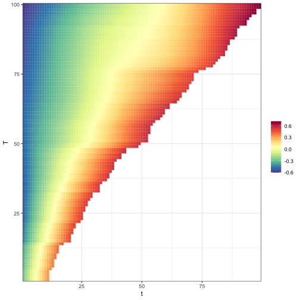

## Introduction

The VDPO package provides, among other tools, methods for analyzing variable domain functional data. This vignette demonstrates how to fit variable domain functional regression models using the `vd_fit` function, which is designed to handle various types of functional and non-functional covariates in a flexible framework.

## Data Generation


``` r
library(VDPO)
```

We'll start by generating sample data using the `data_generator_vd` function. This function creates simulated data with variable domain functional covariates and additional non-functional covariates if specified.


``` r
# Generate data with functional and non-functional covariates
data <- data_generator_vd(beta_index = 1, use_x = TRUE, use_f = TRUE)
```

## Model Fitting

The `vd_fit` function is the main tool for fitting variable domain functional regression models. It supports various model specifications through a formula interface.

### Basic Model with Single Functional Covariate

Let's start with a basic model using only the functional covariate:


``` r
data <- data_generator_vd(beta_index = 1, use_x = FALSE, use_f = FALSE)
formula <- y ~ ffvd(X_se, nbasis = c(10, 10, 10))
res <- vd_fit(formula = formula, data = data)
```

### Model with Multiple Functional Covariates

If your data contains multiple functional covariates, you can include them in the model:


``` r
data <- data_generator_vd(
  beta_index = 1,
  use_x = FALSE,
  use_f = FALSE,
  multivariate = TRUE
)
formula <- y ~ ffvd(X_se, nbasis = c(10, 10, 10)) + ffvd(Y_se, nbasis = c(10, 20, 10))
res_multi <- vd_fit(formula = formula, data = data)
```

### Model with Functional and Non-Functional Covariates

The `vd_fit` function also supports including non-functional covariates, both linear and smooth terms:


``` r
data <- data_generator_vd(beta_index = 1, use_x = TRUE, use_f = TRUE)
formula <- y ~ ffvd(X_se, nbasis = c(10, 10, 10)) + f(x2, nseg = 30, pord = 2, degree = 3) + x1
res_complex <- vd_fit(formula = formula, data = data)
```

In this model:

-   `ffvd(X_se, nbasis = c(10, 10, 10))` specifies the functional covariate
-   `f(x2, nseg = 30, pord = 2, degree = 3)` adds a smooth effect for `x2`
-   `x1` is included as a linear term

## Model Summary

You can obtain a summary of the fitted model using the `summary` function:


``` r
summary(res_complex)
#> 
#> Family: gaussian 
#> Link function: identity 
#> 
#> 
#> Formula:
#> NULL
#> 
#> 
#> Fixed terms: 
#>                                  x2                                     
#>   1.4678062   0.9742174  -0.1430355  -3.5265899   5.2136636 -10.5801911 
#>             
#>   6.0838833 
#> 
#> 
#> Estimated degrees of freedom:
#> Total edf     Total      <NA>      <NA>      <NA> 
#>    4.9380    4.5461    0.0001    9.4842   16.4842 
#> 
#> R-sq.(adj) =  0.958   Deviance explained = 97.5%  n = 100
#> 
#> Number of iterations: 1
```

## Working with Non-Aligned Data

The `vd_fit` function can handle both aligned and non-aligned functional data. Here's an example with non-aligned data:


``` r
data_not_aligned <- data_generator_vd(aligned = FALSE, beta_index = 1)
formula <- y ~ ffvd(X_se, nbasis = c(10, 10, 10))
res_not_aligned <- vd_fit(formula = formula, data = data_not_aligned)
```

## Additional functionality

If you need to include an offset in your model, you can use the `offset` argument:


``` r
offset <- rnorm(nrow(data$X_se))
res_with_offset <- vd_fit(formula = formula, data = data, offset = offset)
```

### Plotting the betas

A heatmap for a specific beta of the model can be obtained by using the plot function:


``` r
plot(res)
```



## Final remarks

The `vd_fit` function in the VDPO package provides a flexible and powerful tool for fitting variable domain functional regression models. It supports a wide range of model specifications, including multiple functional covariates, non-functional covariates, and various distribution families. By leveraging the formula interface, users can easily specify complex models tailored to their specific analysis needs.
