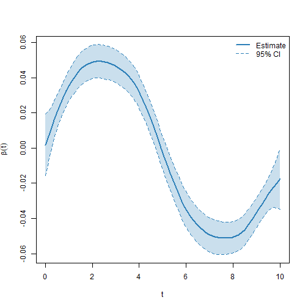

## Introduction

Partially observed functional data arise when each curve is recorded only on part
of its domain, leaving one or more gaps. This is common when sensors fail for a
period, when measurements are taken only while a condition holds, or when images
are partially occluded. Discarding the incomplete curves or imputing the missing
parts can bias the analysis, so it is preferable to work directly with the
observed information.

The `VDPO` package implements a scalar-on-function regression model for this
setting. The functional covariate and the functional coefficient are represented
with B-spline bases, and the model is estimated through the mixed model
representation of penalized splines, which also takes care of the smoothing
parameters. The approach is described in Hernandez-Amaro et al. (2025).

This vignette shows how to simulate partially observed data, fit the model with
`po_fit`, and inspect the estimated functional coefficient together with its
pointwise confidence intervals.


``` r
library(VDPO)
```

## Data generation

The `data_generator_po_1d` function simulates a scalar response together with a
partially observed functional covariate. Its main arguments control the number of
curves (`n`), the number of points in the common grid (`grid_points`), the
response distribution (`response_type`), the shape of the true coefficient
(`linear_predictor`) and the number of unobserved segments per curve
(`n_missing`).


``` r
set.seed(123)
sim <- data_generator_po_1d(n = 150, grid_points = 80)
```

The returned list contains the observed curves in `noisy_curves_miss`, with `NA`
on the unobserved part of each domain, the indices of the unobserved points in
`missing_points`, the common grid in `grid`, the scalar `response`, and the true
functional coefficient in `beta`, which we will use to assess the estimate.


``` r
mean(is.na(sim$noisy_curves_miss))
#> [1] 0.2
```

## Model fitting

The functional covariate enters the model through the `ffpo` constructor. Its
arguments are the matrix of observed curves (`X`), the list of unobserved indices
(`missing_points`), the common `grid`, and the basis specification: `nbasis` gives
the number of basis functions for the curve representation and for the
coefficient.

The model is fitted with `po_fit`, which uses the same formula interface as the
other model-fitting functions in the package.


``` r
fit <- po_fit(
  response ~ ffpo(X = sim$noisy_curves_miss, missing_points = sim$missing_points,
                  grid = sim$grid, nbasis = c(30, 30)),
  data = list(response = sim$response, X = sim$noisy_curves_miss,
              grid = sim$grid, missing_points = sim$missing_points)
)
```

The fitted object is a list of class `po_fit`. It returns the estimated functional
coefficient (`Beta`), the intercept, the basis coefficients (`theta`) and their
covariance (`covar_theta`), the observed-domain information (`M`), and the
evaluations of the functional term (`ffpo_evals`).


``` r
str(fit, max.level = 1)
#> List of 7
#>  $ fit        :List of 15
#>   ..- attr(*, "class")= chr "sop"
#>  $ Beta       :List of 1
#>  $ intercept  : num 0.105
#>  $ theta      : num [1:30, 1] -0.01223 0.00181 0.01579 0.02877 0.03864 ...
#>  $ covar_theta: num [1:30, 1:30] 2.13e-04 1.20e-04 4.76e-05 6.97e-06 -8.03e-06 ...
#>  $ M          :List of 1
#>  $ ffpo_evals :List of 1
#>  - attr(*, "class")= chr "po_fit"
#>  - attr(*, "N")= int 150
```

## Estimated coefficient

The element `Beta` holds, for each functional term, a data frame with the grid
(`t`), the estimated coefficient (`beta`), its standard error (`se`) and the lower
and upper limits of the pointwise confidence interval (`lower` and `upper`).


``` r
b <- fit$Beta[[1]]
head(b)
#>           t        beta          se        lower      upper
#> 1 0.0000000 0.001797685 0.008967647 -0.015778581 0.01937395
#> 2 0.1265823 0.006577162 0.007498188 -0.008119017 0.02127334
#> 3 0.2531646 0.011312337 0.006318194 -0.001071096 0.02369577
#> 4 0.3797468 0.015964972 0.005450567  0.005282057 0.02664789
#> 5 0.5063291 0.020487481 0.004870483  0.010941509 0.03003345
#> 6 0.6329114 0.024802314 0.004556353  0.015872026 0.03373260
```

The coefficient is displayed together with its confidence band.


``` r
plot(b$t, b$beta, type = "n", xlab = "t", ylab = expression(beta(t)),
     ylim = range(c(b$lower, b$upper)))
polygon(c(b$t, rev(b$t)), c(b$lower, rev(b$upper)),
        col = grDevices::adjustcolor("#2c7fb8", 0.25), border = NA)
lines(b$t, b$beta,  col = "#2c7fb8", lwd = 2)
lines(b$t, b$lower, col = "#2c7fb8", lty = 2)
lines(b$t, b$upper, col = "#2c7fb8", lty = 2)
legend("topright", legend = c("Estimate", "95% CI"),
       col = "#2c7fb8", lty = c(1, 2), lwd = c(2, 1), bty = "n")
```



Because the data are simulated, the estimate can be compared with the true
coefficient. The correlation between the two is high, which confirms that the
shape of the coefficient is recovered well.


``` r
true_beta <- sim$beta[seq_along(b$beta)]
cor(b$beta, true_beta)
#> [1] 0.9938624
```

## The two-dimensional case

When the functional observations are surfaces that are partially observed, the
same workflow applies through the analogous functions `data_generator_po_2d`,
`ffpo_2d` and `po_2d_fit`. The fitted object has the same structure, with the
estimated coefficient returned as a surface.

## References

Hernandez-Amaro et al. (2025). A new scalar on function generalized additive model
for partially observed functional data. <doi:10.48550/arXiv.2510.26917>.
