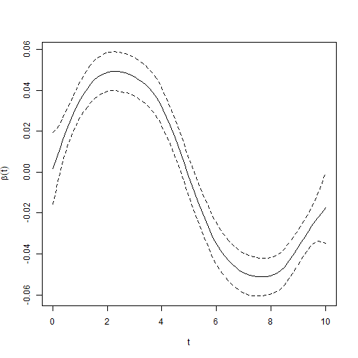

## Introduction

The VDPO package also provides methods for partially observed functional data,
where each curve is recorded only on a subset of its domain. This vignette shows
how to fit a partially observed functional regression model with the `po_fit`
function and how to inspect the estimated functional coefficient.

## Data generation


``` r
library(VDPO)
```

The `data_generator_po_1d` function simulates a scalar response together with a
partially observed functional covariate.


``` r
set.seed(123)
sim <- data_generator_po_1d(n = 150, grid_points = 80)
```

The returned list contains `noisy_curves_miss` (the observed curves, with `NA` on
the unobserved part of each domain), `missing_points` (the indices of the
unobserved points), `grid` (the common grid), `response` and `beta` (the true
functional coefficient).

## Model fitting

The functional covariate enters the model through the `ffpo` constructor, and the
model is fitted with `po_fit`.


``` r
fit <- po_fit(
  response ~ ffpo(X = sim$noisy_curves_miss, missing_points = sim$missing_points,
                  grid = sim$grid, nbasis = c(30, 30)),
  data = list(response = sim$response, X = sim$noisy_curves_miss,
              grid = sim$grid, missing_points = sim$missing_points)
)
```

The fitted object reports the estimated functional coefficient together with the
covariance of its basis coefficients, from which pointwise confidence intervals
are obtained.


``` r
str(fit, max.level = 1)
#> List of 7
#>  $ fit        :List of 15
#>   ..- attr(*, "class")= chr "sop"
#>  $ Beta       :List of 1
#>  $ intercept  : num 0.105
#>  $ theta      : num [1:30, 1] -0.01223 0.00181 0.01579 0.02877 0.03864 ...
#>  $ covar_theta: num [1:30, 1:30] 2.13e-04 1.20e-04 4.76e-05 6.97e-06 -8.03e-06 ...
#>  $ M          :List of 1
#>  $ ffpo_evals :List of 1
#>  - attr(*, "class")= chr "po_fit"
#>  - attr(*, "N")= int 150
```

## Estimated coefficient

The element `Beta` holds, for each functional term, a data frame with the grid
(`t`), the estimated coefficient (`beta`), its standard error (`se`) and the
pointwise confidence limits (`lower`, `upper`).


``` r
b <- fit$Beta[[1]]
head(b)
#>           t        beta          se        lower      upper
#> 1 0.0000000 0.001797685 0.008967647 -0.015778581 0.01937395
#> 2 0.1265823 0.006577162 0.007498188 -0.008119017 0.02127334
#> 3 0.2531646 0.011312337 0.006318194 -0.001071096 0.02369577
#> 4 0.3797468 0.015964972 0.005450567  0.005282057 0.02664789
#> 5 0.5063291 0.020487481 0.004870483  0.010941509 0.03003345
#> 6 0.6329114 0.024802314 0.004556353  0.015872026 0.03373260
```


``` r
matplot(b$t, cbind(b$beta, b$lower, b$upper), type = "l",
        lty = c(1, 2, 2), col = 1, xlab = "t", ylab = expression(beta(t)))
```



The bidimensional case (partially observed surfaces) follows the same interface
through `data_generator_po_2d`, `ffpo_2d` and `po_2d_fit`.
