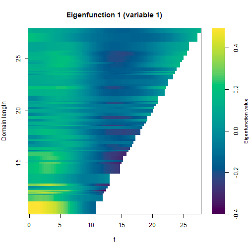
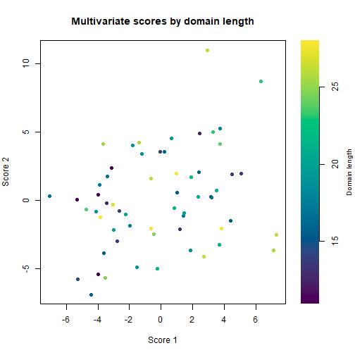

## Introduction

Variable domain functional data arise when each subject is observed over a domain
of its own length. A clinical monitoring study is a typical example: each patient
is followed for a different number of days, so the curves share a common starting
point but end at different times. When several such processes are recorded for the
same subjects (for instance oxygen saturation and body temperature), they should
be analyzed jointly, because the modes of variation of one process are often
related to those of the others.

The `mfpca_vd` function performs a multivariate functional principal component
analysis (MFPCA) for this setting. It proceeds in two stages. First, each variable
is decomposed through a variable domain functional principal component analysis,
which produces eigenfunctions and scores that depend on the domain length. Second,
the univariate scores of all variables are combined into a single multivariate
decomposition whose components also vary with the domain. The method is described
in Hernandez-Amaro et al. (2026).

This vignette shows how to prepare the data, run the analysis and inspect the
results with the `plot` method.


``` r
library(VDPO)
```

## Data generation

The input is a list with one matrix per functional variable. Each matrix has
subjects in rows and observation points in columns, and is left-aligned: the
recorded values occupy the first columns of each row, and the rest is filled with
`NA`. A second list of matrices, with the same shape, holds the actual observation
time of every measurement.

We simulate two variables observed on variable domains. For each subject we draw a
random number of observations and a random domain length, and build a smooth curve
plus a small amount of noise.


``` r
set.seed(1)
N <- 60
maxcols <- 28

make_variable <- function(seed_shift) {
  set.seed(100 + seed_shift)
  Data  <- matrix(NA_real_, N, maxcols)
  Times <- matrix(NA_real_, N, maxcols)
  for (i in seq_len(N)) {
    ni <- sample(12:maxcols, 1)
    tt <- sort(runif(ni, 0, ni))
    Data[i, seq_len(ni)]  <- rnorm(1) * sin(tt / 3) + rnorm(1) * cos(tt / 5) +
      rnorm(ni, 0, 0.1)
    Times[i, seq_len(ni)] <- tt
  }
  list(Data = Data, Times = Times)
}

v1 <- make_variable(1)
v2 <- make_variable(2)
```

It is convenient to order the subjects from the shortest to the longest domain, so
that the data matrices are easier to read and the results are easier to interpret.
We compute the domain of each subject as the largest observed time across the two
variables and reorder the rows accordingly.


``` r
domain <- pmax(apply(v1$Times, 1, max, na.rm = TRUE),
               apply(v2$Times, 1, max, na.rm = TRUE))
ord <- order(domain)

Data  <- list(v1$Data[ord, ],  v2$Data[ord, ])
Times <- list(v1$Times[ord, ], v2$Times[ord, ])
```

After reordering, the first rows correspond to the subjects with the shortest
follow-up and the last rows to those with the longest, while every row remains
left-aligned.


``` r
c(first = sum(!is.na(Data[[1]][1, ])), last = sum(!is.na(Data[[1]][N, ])))
#> first  last 
#>    12    26
```

## Specifying the observation times

The observation times can be supplied in two mutually exclusive ways:

* through `Times`, as above, when the measurements are taken at arbitrary
  (possibly irregular) times; the domain of each subject is then taken as its
  largest observed time;
* through `M_grid`, a vector of length `N` with the domain length of each subject,
  when the measurements are equidistant; in that case the grid of subject `i` is
  `seq(0, M_grid[i], by = 1 / Hz)`, where `Hz` is the sampling rate.

Only one of the two should be provided. In this vignette we use `Times`.

## Estimation

The analysis is run with `mfpca_vd`. The main arguments are the number of
multivariate components to keep (`m_npcs`), the number of univariate components
retained per variable (`u_npcs`), the dimension of the basis used to smooth the
score covariances along the domain (`k_m`), and the smoother (`model_type`, either
`"gam"` or `"sop"`).


``` r
res <- mfpca_vd(
  Data  = Data,
  Times = Times,
  m_npcs = 3, u_npcs = 4, k_m = 8
)
```

The result is a list. The most relevant elements are `scores_m` and
`efunctions_m` (the multivariate scores and eigenfunctions), `scores_u` and
`efunctions_u` (their univariate counterparts), `evalues_u` and `evalues_m` (the
eigenvalues), `var_u` (the cumulative variance explained by the univariate
components), `mean_model` (the fitted mean of each variable) and `M_grid` (the
domains used).


``` r
str(res, max.level = 1)
#> List of 10
#>  $ scores_m    : num [1:60, 1:3] -5.32 2.41 4.5 -4 1.01 ...
#>  $ efunctions_m:List of 60
#>  $ efunctions_u:List of 2
#>  $ scores_u    : num [1:60, 1:8] -5.07 4.02 -3.25 -6.35 1.1 ...
#>  $ evalues_u   :List of 2
#>  $ evalues_m   :List of 60
#>  $ var_u       :List of 2
#>  $ mean_model  :List of 2
#>  $ M_grid      : num [1:60] 11 12.5 13.7 11.2 15.5 ...
#>  $ argvals_u   :List of 2
#>  - attr(*, "class")= chr "mfpca_vd"
```

## Eigenfunctions

Because the domain changes across subjects, the eigenfunctions are not single
curves but families of curves indexed by the domain length. A convenient way to
look at them is to draw a given component at a few fixed domains, superimposed as
lines. The `plot` method does this for the chosen variable and components; the
sign of each curve is aligned so that they overlay consistently.


``` r
plot(res, type = "eigenfunctions", variable = 1, components = 1:2)
```


Each line is the eigenfunction evaluated on the domain of a subject, so longer
domains produce longer curves. Comparing the curves shows how the shape of the
mode of variation changes as the follow-up gets longer.

The full picture across all domains is shown as a heatmap, with time on the
horizontal axis and the domain length on the vertical axis (ordered from shortest
at the bottom to longest at the top). The color encodes the value of the
eigenfunction, and the triangular shape reflects that each domain only reaches its
own length.


``` r
plot(res, type = "heatmap", variable = 1, components = 1)
```



## Scores

The multivariate scores summarize each subject in a small number of values. They
can be displayed colored by domain length, which is useful to check whether the
scores are associated with the follow-up length or capture other features of the
data.


``` r
plot(res, type = "scores", components = 1:2)
```



A different functional variable is shown by changing the `variable` argument, and
further components with the `components` argument.

## References

Hernandez-Amaro et al. (2026). Variable Domain Multivariate Functional Principal
Component Analysis. <doi:10.48550/arXiv.2605.03633>.
