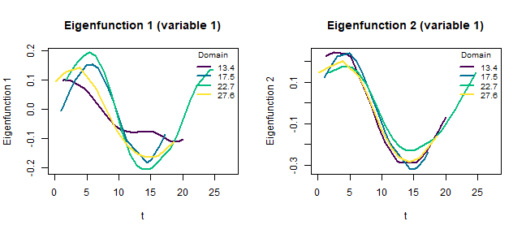
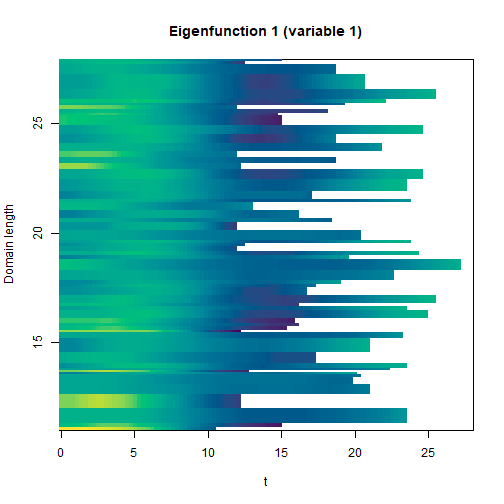
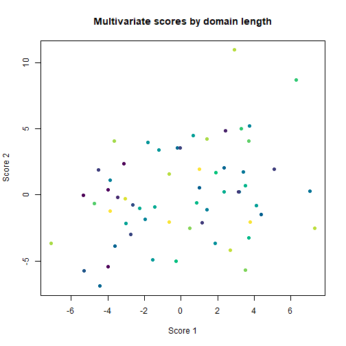

## Introduction

The `mfpca_vd` function performs a multivariate functional principal component
analysis for data observed on subject-specific (variable) domains. Each variable
is first decomposed through a variable domain FPCA, and the univariate scores are
combined into a domain-varying multivariate decomposition.

## Data generation


``` r
library(VDPO)
```

We simulate two functional variables observed on variable domains. For each
subject, the matrix of observations carries `NA` beyond its domain, and a second
matrix holds the actual observation times.


``` r
set.seed(1)
N <- 60
maxcols <- 28

make_variable <- function(seed_shift) {
  set.seed(100 + seed_shift)
  D  <- matrix(NA_real_, N, maxcols)
  Ti <- matrix(NA_real_, N, maxcols)
  for (i in seq_len(N)) {
    ni <- sample(12:maxcols, 1)
    tt <- sort(runif(ni, 0, ni))
    D[i, seq_len(ni)]  <- rnorm(1) * sin(tt / 3) + rnorm(1) * cos(tt / 5) + rnorm(ni, 0, 0.1)
    Ti[i, seq_len(ni)] <- tt
  }
  list(Data = D, Times = Ti)
}

v1 <- make_variable(1)
v2 <- make_variable(2)
```

## Estimation

The data are passed as a list of matrices. The observation times are given
through `Times` (one matrix per variable); alternatively, for equidistant
designs, a vector of domain lengths can be passed through `M_grid`.


``` r
res <- mfpca_vd(
  Data  = list(v1$Data, v2$Data),
  Times = list(v1$Times, v2$Times),
  m_npcs = 3, u_npcs = 4, k_m = 8
)
str(res, max.level = 1)
#> List of 10
#>  $ scores_m    : num [1:60, 1:3] 3.52 3.72 -3.6 -1.82 4.1 ...
#>  $ efunctions_m:List of 60
#>  $ efunctions_u:List of 2
#>  $ scores_u    : num [1:60, 1:8] -6.58 3.49 -5.25 4.95 -1.93 ...
#>  $ evalues_u   :List of 2
#>  $ evalues_m   :List of 60
#>  $ var_u       :List of 2
#>  $ mean_model  :List of 2
#>  $ M_grid      : num [1:60] 24.4 17.9 15.6 18.9 19.5 ...
#>  $ argvals_u   :List of 2
#>  - attr(*, "class")= chr "mfpca_vd"
```

## Eigenfunctions

The estimated eigenfunctions vary with the domain length. They can be displayed
at a few fixed domains as superimposed lines.


``` r
plot(res, type = "eigenfunctions", variable = 1, components = 1:2)
```



The full picture across all domains is shown as a heatmap (time on the
horizontal axis, domain length on the vertical axis).


``` r
plot(res, type = "heatmap", variable = 1, components = 1)
```



## Scores

The multivariate scores can be displayed colored by domain length.


``` r
plot(res, type = "scores", components = 1:2)
```


